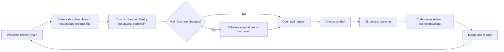

# Git Workflow

This project uses a trunk-based development workflow. The "main" branch is the protected trunk and is the source of truth for the project.

## Branches

- Changes must be developed on short-lived personal branches created from "main".
- Branch names must follow the "<type></type>/<short-description></short>" convention, for example:
  - "feature/add-product-filter"
  - "fix/login-redirect"
  - "chore/update-ci"
- Do not commit directly to "main".
- Avoid rebasing shared branches. Rebase only your personal branch onto "main" when you need to bring the latest trunk changes into your work.

## Commits and Local Checks

Commits must follow the project's Conventional Commits convention. Local checks are enforced by Husky:

- `pre-commit` runs `lint-staged` to lint and format staged files.
- `commit-msg` runs `commitlint` to validate the commit message.

Examples:

```text
feat: add product filtering
fix: handle expired session
chore: update CI workflow
```

## Pull Requests

- "main" can only be updated through a pull request.
- Select at least one relevant label when opening a pull request.
- Pull requests must pass CI before they are merged. CI currently runs the repository lint command only.
- Code owner review is required from `@chunghoangtu`, who owns the entire repository.
- When merging, **Merge and rebase** is recommended to keep the trunk history linear.

## Trunk-Based Flow



The practical flow is:

1. Update local "main".
2. Create a short-lived branch named "<type></type>/<short-description></short>".
3. Make small commits that pass Husky checks.
4. Rebase your personal branch from "main" if the trunk has moved.
5. Open a pull request, choose a label, and wait for CI and code owner review.
6. Merge using **Merge and rebase** after all requirements pass.
